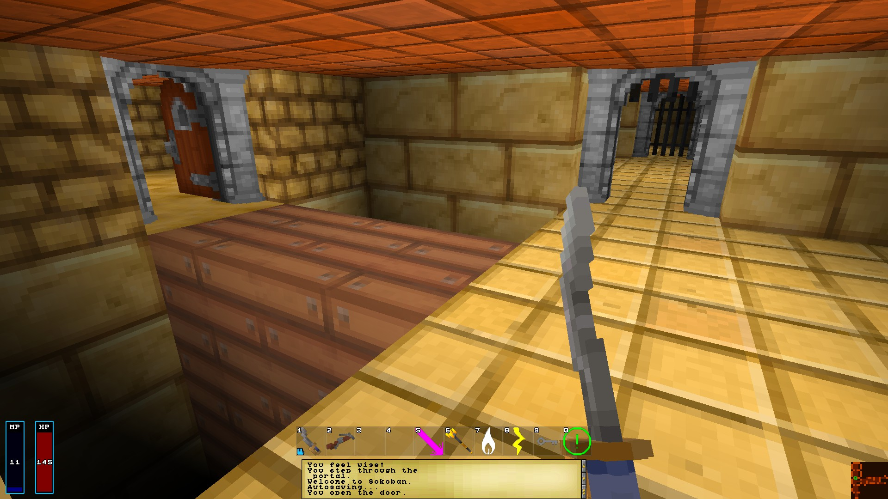
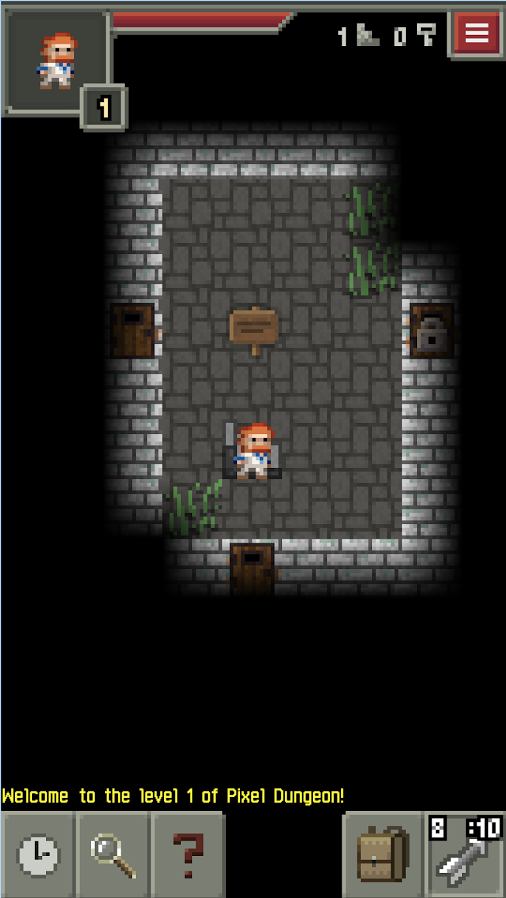

# The Nth Society - A voluntaryist roleplaying game and decentralized project

## Proposal

**To design, develop and play a game which explores life in a voluntary society.**

## Introduction

You can think of this as the off-white paper, a fun term coined (I think) by @stellabelle. It is the prototype that will serve as the basis for a future whitepaper.

Voluntary and free relationships can be hard to practice within statist societies, where many practical avenues of action are tainted by the hand of the state. For many of us it does not make sense to simply "leave" society for a voluntaryist village or micro-nation somewhere, or to form a community of likeminded voluntaryists where we live, attractive as this option might be. Perhaps this is because there are not that many local voluntaryists that we know, or that we are in some way bound to where we are because of family obligations, work commitments or health issues, or perhaps that we are just not that sure about it yet.

Wouldn't it be beneficial to try out some of these ideas in a virtual world to get to know others who are interested in that life, to figure out the unique challenges it would pose, and to decide whether or not we would like to commit to this in the real world? We propose a game world to facilitate this discovery.

We rely on a few assumptions, which I will make explicit:

*   Games can be used as discovery and teaching tools.
*   Computer games are necessarily imperfect simulators of real world ideas. (see [Ludic Fallacy](https://en.wikipedia.org/wiki/Ludic_fallacy))
*   Nevertheless, games can be used to test real world ideas before testing further in the real world.

A team of people is needed to plan, create and to play such a game. This document lays out the basic idea as developed by @personz, and @the-ego-is-you, who is co-signer of this proposal (to be observed in a comment). @rycharde was also consulted and will hopefully be continuing contributor also. 

Right off the bat I want to note that it's not only in playing the game that these ideas will be tested and discovered _but also in the making of it_, for those that get involved and contribute. I see it as potentially 

another platform through which ideas can be shared and discussed.

## The Game

The computer game should model a free society or the conditions for a free society in some way, and be expressive enough for players to be able to interact with each other and the environment in a system which models the relevant aspects of life.

### Basics

*   **Players:** Physical players with full ability to move with the world in accordance with their own bodily power and the laws of nature.
*   **Land:** The game must provide land which can be occupied, and built on, etc., as well as it's natural state be modified.
*   **Objects:** The game must provide objects which can be picked up, combined, dismantled, consumed, crafted, etc. A player's personal carrying capabilities should be realistic, i.e. limited space and limited weights. Additionally sufficiently large or heavy objects may block a players movement, e.g. boulders, walls, cliffs.
*   **Skills:** Players must be able to acquire skills. Practically this provides the methods to combine objects, possibly with land, in order to make new objects or disassemble objects into other constituent objects.
*   **Communication**: Players must be capable of some form of digital "speech". Preferably adjustable to short or long distance, public or private expression.

The following proposed minimal set of features are fundamental to the game:

*   The game world, as in the real world, as facility for the protection and free transfer of cryptocurrency.
*   Player avatars may be born, live and die. There is a cost associated with being born. (see discussion below)
*   The game world will exist in continuous time and allow unrestricted access of all players to their player avatars via the internet, dependent on technical connectivity only.
*   A provision must be made for automatic "life" when the player is offline, based on their immediate available resources, including self-organized safety. We can perhaps call this sleepwalking mode.

No game engine, style, or technology is proscribed, but at least one is needed. There are a lot of open sources engines to choose from and I've done a little survey of some of the obvious options just as food for thought:

*   [Isogenic Game Engine](http://www.isogenicengine.com/), an isometric open source game engine with a lot of support
*   [Evennia](http://www.evennia.com/), multiplayer text game engine in style of a MUD
*   [Isleward](https://gitlab.com/Isleward/isleward), pixel graphics roguelike, already a game but could be forked as is open source
*   [Barony](https://github.com/TurningWheel/Barony), first person raycaster type low res, game already also
*   [Pixel Dungeon](https://github.com/watabou/pixel-dungeon), simple rogue like top view low res tile engine game, many mods and forks already for this, good community. For mobile platform.

#### Screenshots

##### Isogenic Game Engine


##### Evennia


##### Isleward


##### Barony



##### Pixel Dungeon



Similarly, the platform is not yet decided. It may work well as a mobile app, as a browser game or as a standalone desktop client. I could even be made for a console which supports indie developers.

### Contracts

A provision must be made in the game for

*   Contract creation, replication and management
*   Multiparty signing These contracts are NOT enforced by the game world natural laws, just like in the real world, the universe does not guarantee contracts. Rather they are respected (or not) by players. The game should just provide the facility for their record. The only exception to this is escrow which is a built in system of the cryptocurrency wallet.

### Death and Life

The game will only be able to test ideas and to be of most utility to its users if people can behave in a similar way to real life; that is, to preserve their life, continue their survival and build a living - or to do the opposite if they so choose.

For this reason **there is a cost to starting a new life in the game**, a cost which is payable from the account generating a new player child to the guardians who they choose, or to the "system" by way of transfer to @null if no guardians are available. Every life born has a speeded up childhood lasting a certain fixed period (yet to be decided), before coming of age as an adult. Every person can die, and _must die_ of old age at a certain age (formula for this also yet to be decided).

We use the term "guardian" to side-step the biological process of procreation. As guardian you are reasonably responsible for the survival of the new child player, but _they are not your offspring_. Thus only one person is required to bring a child into the game world, not two as in biological birth.

A ticket and lobby system is used for player creation with the following process:

*   A ticket is **bought** by any adult player, for the _**ticket creation fee**_ amount as a transfer to @null with special memo, which registers their intention to become the guardian of a new child player. There is no limit on the number of tickets an adult player can create and keep actively open, save a very large sane limit (say, 1000). The ticket fee is non-refundable and non-transferable, but can be voided by the guardian buyer if they choose.
*   A potential player sees the ticket in the game lobby, selects it and pays the _**new player fee**_ plus the _**escrow fee**_ to the arbiter agent, by way of escrow transfer. The _new player fee_ is held in escrow for a number of days (the period has yet to be decided), and a random other player is assigned as arbiter agent_._
*   If the player did not die of foul play in that time (infanticide, neglect, etc.), the _new player fee_ is delivered to the guardian and the _escrow fee_ is payed to the arbiter agent. If they did die of bad circumstances then the arbiter agent should return the fee to the player account. The arbiter is paid their fee either way. 

Successful child rearing statistics are automatically available for **all accounts** (that is, not just per player instance, but permanently per account) so player guardians who engage in foul play can be identified by potential player children in advance. There is also nothing to stop people sharing information in and out of the game world about trustable guardians by word of mouth.

Random tickets are also generated from time to time depending on demand. They work the same way but the child is "born" fully adult and the payment is payable to @null directly with no escrow. For example the very first players of a new world must do this.

The above system incentivizes players to become _guardians_ in a similar way that we real humans are incentivized to become _parents_ by biological impetus. Since there is a flow of funds from potential children to guardians, the life / death cosmic economy has the following result:

*   If you do not have any children, you have paid X to play the game life
*   If you have one child you almost break even and this life costs you nothing, except a much smaller fee than you originally paid
*   If you have more than one child you can actually earn money by playing the game.

The ticket creation fee is obviously used to force guardians to have some skin in the game, and not simply a loss of opportunity of gaining the new player fee if they act badly. The ticket creation fee is some small percentage of the new player fee, say 5%. The escrow fee should also be small, and is paid whether the transfer is made or revoked, so this works toward making sure the new player has some skin in the game also.

It is possible that the best arrangement is to allow game world server creators to set the fee parameters of the world, and perhaps it should be updatable by consensus of players, to allow for game token market values to be taken into account. This point needs further discussion.

### Game Servers

Every game client is to also be a game server. Thus there is no central game server and the structure is decentralized. Everyone playing the game is also running the game.

Anyone can create a new game and have other people join as peers, and any client / server will be able to connect to any other world running as long as there is available connectivity with client / servers running that game. Each newly created game world will have a unique human readable random identifier so that game players can choose the right one. Note however that due to the cost to the first players of a game world (see above Death and Life) it is expensive to start a new game world, incentivizing players to stick to existing game worlds.

There are some other benefits to decentralization. It means that no one person can make the game inaccessible to other players, every user has the ability to continue running the game, even if they delete it locally. No-one can play god and modify the game world in a way that is beyond their player's capabilities because other servers will reject inconsistent game state changes. This will preserve the game state and keep it stable, leading to a high degree of reliability.

### Decentralized infrastructure

Centralized game servers have advantages. There is just one server that needs to store the master game data, and one trusted authority for getting this data so we can be sure as a player that we are experiencing the same game world as other players. And since there is just one connection point, a simple login or other centralized credential system is all that's required to gain access to play on the server.

However decentralization has some advantages over centralized game servers, as mentioned above, but the two mentioned features of centralized server design (central game data store, single trusted accreditation source) are problems to be solved by decentralized gaming systems. This proposal does not mandate any particular solution but we are confident that an appropriate solution exists.

It seems likely that a blockchain solution will be best suited, though the pros and cons would need to be weighed up and we should not simply assume that a game that uses blockchain currency should necessarily use a blockchain to store game data and activity (i.e don't just put a blockchain on it!). However there are some options in this space already, such as the soon to be released [Chimaera](https://chimaera.io/) gaming blockchain, or using our own side chain, perhaps a private side chain using [Hyperledger](https://hyperledger.org/) or [Quorum](https://github.com/jpmorganchase/quorum) for example.

This is a point for serious further discussion. As long as the requirements are met it doesn't matter which solution is used.

## Development model

The following is the development model which I propose be adopted:


The above graph shows an overview of how the project organization might work. After the initial proposal, which is published to Utopian.io and GitHub, a group of contributors forms and works in 5 general branches, The Five Ds:

* Discussion - contributing long form opinion pieces
* Design - all kinds of structural, artistic and concrete planning
* Documentation - writing well thought out, well formatted docs for devs, users and in fact all stakeholders
* Development - coding, generating art, music, etc.
* Decision Making - gathering discussion points for all to review and implement

This feeds into the bottom part of the graph, which outlines some of the workings of the game itself as proposed at this point. This will definitely change so it only serves as a visual summary of what you can read above in detail.

The rest is to happen now.

### Un-management structure

There is no management structure and all members are autonomous. Instead of a hierarchical team structure I suggest that we leverage the ideas of decentralization and the _version control_ concept of "forking". There can be more than one Nth Society project developing at the same time. It is up to the individual community members themselves to decide who they work with and what they call their work. This very document and the people that worked on it are no exception.

I have created a first GitHub repository [here] which is called the Nth Society. If you want to join us to work on this all you have to do is fork the repository. You can contribute changes back to my repo if you want to use a pull request **but you don't have to**. In fact if you don't like where the project is going you can keep your own fork to yourself and work with whomever you want on it. If the original project wants to join up with a fork there are ways of doing this too. There would be little point of doing this right now, ideally we would work together, but you're always free to do as you please.

A community will form around whichever repo is the best. It's natural to want to pool work together but I do not presume to own or direct that pool, though you can follow my initial ideas if you want. I'm just starting the idea as a seed, and I want to see how people pick it up. I'm hoping to get to the stage where **I'm the one following your ideas!**

The work so far is completely open license, using [CC0]. This restricts nothing. Since I am personally opposed to software licensing I will not accept any pull request to my repos that introduces any other license, except in the case of required 3rd party software. However, as with everything, you are free to do as you wish in this regard.

Note also that if / when we incorporate other software (game engines, etc.), even if open source, we will be subject to whatever license comes with it, but just for that part. This is unfortunately unavoidable.

### Community Bot supporter

I've created a bot which will support posts to Steem created for the Nth Society project, leveraging Utopian.io. It will attempt to match the up vote of any Utopian.io accepted post with the tag #nth-society, to the amount up voted by other Nth Society contributors and the @utopian-io bot, excluding the poster's vote, 5 days after the post date, and scaled by the SP delegated to the bot.

Requirements for Community Bot recognition:

*   The Community Bot will only up vote posts which have been approved by Utopian mods so make sure you follow their guidelines.
*   It will only recognize posts with **both the #nth-society and #utopian-io tags**. Be careful of misspellings.
*   It will only recognize posts made by Nth Society contributors (see below for how it to set yourself up as a contributor).
*   It will only recognize up votes by the @utopian-io bot and _other project contributors_ not including any vote from the poster.
*   It will _try_ to up vote you to the target amount but it is dependent on voting power and delegated SP (see below).
*   If you abuse the system you will be blacklisted (see below).

**Note:** by Utopian rules, contributions must be concrete. So unfortunately this does not cover game planning as such but only "suggestions" which must be detailed technical suggestions. For example if you proposed the protocol for storing the game data, with some research on that, and a path to implementation. Additionally development, graphics, tutorials, bugs, copywriting, docs all fit in with the Utopian system. However I will be lobbying them to update this as for the moment general game design posts cannot be made through Utopian.

The delegated SP to the bot determines what percentage of the target value it will attempt to vote to. This is scaled to the target SP delegation of 100k SP, the scaling formula is

```target_value * (actual_SP / 100,000)```

The bot currently has 1k SP and will operate at 1% target value.

For example, you post about your contribution to the project, say with some art sketches, you post with both the #nth-society tag and the #utopian-io tag. Three other Nth Society contributors up vote your post and their votes total $3\. Then the Utopian mods approve your contribution and their bot up votes to the value of $4\. You also up vote your own post to the value of $0.50 and some others up vote to the value of $10\. In total the post has $17.50 pending payout. The Nth Society Community Bot will try to up vote you to the value of $3 + $4 = $7 at 1%, so $0.07, and will wait until 5 days after your post was first published. This is to allow other votes to come in and for the Utopian mods to review it, but not so long as to appear sneaky.

#### Bot accounts are not "official" bots

An Nth Society Bot can be run by anyone. I have developed it as an open source project which anyone can run on any account. I created the account @nth-bot to run my instance of the bot on and I've got a bit of delegation from some friends to put to it. But you can run one too, or delegate to this account, whatever you want.

Any abuse of this system will be taken seriously and abusers blacklisted on _my_ bot database (they won't get up voted). For example, contributions that consistently don't actually contribute anything, or other "farming" type behavior. If it turns out that the bot is widely abused I'll have to change the algorithm or shut it down so please be responsible. This does not affect work on the game as such, it only affects the actions of the bot.

#### Bot votes are not payment

Please remember that bot votes are made to the best of the ability of the bot, the code and the services required to run it. You are not entitled to these votes, **they are gifts as support and not to be viewed as payment**. I really want to see this project succeed and I will do everything I can to support it but do not whine if bot votes are interrupted. However you can contact me with any queries or issues you have and I will do my best to address legitimate concerns.

#### @nth-bot live now

Finally, **the bot is final stages of testing**, and my bot will be active for any post made from now which satisfies the requirements. Read the next section and become a recognized contributor.

### Becoming a contributor

In order to be recognized as a contributor to the Nth Society project you need to fork one of the projects on GitHub (such as the original planning repo [here](https://github.com/thrize/nth-society) and add your Steem account name to your GitHub profile bio info.

Note that I use **Steem** and **not Steemit**. We run this on the Steem platform, not through the company Steemit Inc. or steemit.com. All reference to this blockchain is as Steem.

To prove you are a contributor you will need a GitHub account and to link that account to your Steem account, then fork the Nth Society project from me [here](https://github.com/thrize/nth-society) or any fork of it.

1.  Register an account with GitHub. Your GitHub username does not need to be the same as your Steem account name.
2.  Add your Steem account on your account Github bio using the format steem:username, e.g. steem:personz. See my account for example. There can be other text too.
3.  Fork the Nth Society project or other fork of that project.

You will then automatically be recognized as a contributor by the bot.

### Contributing via Utopian.io

As per the Utopian.io format, I will add a few sample tasks to get us going with things that I think might work. You can answer the literal call to action this way. Or you can simple jump right in and fork a repo, get editing and creating. Don't forget to submit contribution reports to Utopian.io, you don't need to run it by anyone to do this. Please just use the #nth-society tag so we can all be aware of each other.

### Communication

It is very important that contributors are aware of each other to build on the work of others, not duplicate effort, move forward with discussion and get inspired. There are

*   Work submission to GitHub repository projects
*   Work announcements as #nth-society / #utopian-io tagged posts
*   Comments, clarifications and challenges on announcements as comments.
*   Chat on the original [Slack server](https://nthsociety.slack.com/) for the Nth Society

There is a ChainBB forum for the Nth Society at https://chainbb.com/f/nth-society where you can post.

The Slack is not “the” Slack for the project, it’s just the one I created. **You can join any time in the next month using this [invite link]()**. Note this is a moderated community, trolls will be banned. You can contact me at @personz on steemit.chat if any questions.

Also when the "communities" feature comes to Steem, we'll definitely be using that too.

## Token and Potential Token Sale

The proposed suggest is that SMTs are used as a game token. Discussion on this, and the exact details of the token will have to take place when more details as information on SMTs becomes available.

As a template idea I propose the following requirements, regardless of whether SMTs are used:

*   Anyone can send, receive and own game coins, regardless of game participation
*   The game itself will in no way directly hinder, tax, or charge user game tokens **except for the creation of your player account**
*   Escrow will be provided as a native operation. In other words, your are free to use the tokens as you wish.

## Goals and aspiration

It is hoped that this idea becomes a novel way to bootstrap a true voluntary society. The use of "a" not "the" voluntary society is indicative; there are others working towards it and some who have achieved something of this. I believe these projects are compatible.

There are many aspirations, but the main one is the pursuit of a free society. We recognize that this is a never ending process and we do not expect the game to show the way to the perfect society, to utopia. Rather it is a way to explore ideas in a sandbox that are worth exploring, and which may be difficult to explore otherwise.

The goal is to explore and train ourselves in the virtual practice of the ideals of voluntary society with the aim to apply it to actual, solid reality, in so far as this is possible. All the while to have fun doing it!

### Last thought on games and gameplay

People love all kinds of games, but roleplaying is unique for allowing the deep and free exploration of ideas. Playing _as a version of ourselves_ in the context of a game is a great way to try out things we wouldn't usually try, to step into another world of opportunity! In the context here I think we can learn a lot from each other by working _and playing_ together. Let's figure it out, what kind of game do you want? How can we create the conditions for freedom? How do you see property, resources, work, time? And of course, how do we protect against violence, fraud and coercion?

Thank you for taking the time to read and understand this. Hit up the comments for any clarifications, thoughts or to point out errors.If you have ideas, don't hesitate to fork the repo or start suggesting already via Utopian.io! Remember, this is just the first version of the document and just the beginning.
